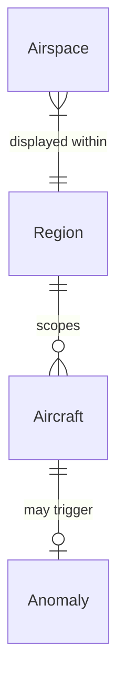

# Data Model: Live Flight Anomaly Radar

**Feature**: 001-flight-anomaly-radar
**Date**: 2026-03-11

## Entities

### Aircraft

The central entity — a tracked flight derived from OpenSky ADS-B state vectors.

| Field | Type | Description | Validation |
|---|---|---|---|
| id | string | ICAO24 hex address (unique per transponder) | 6 hex chars, lowercase |
| callsign | string | Flight callsign (e.g., "DLH1234") | Trimmed; fallback to ICAO24 if null/empty |
| country | string | Origin country from OpenSky | Non-empty string |
| lat | number | Latitude in decimal degrees | -90 to 90, nullable (skip rendering if null) |
| lng | number | Longitude in decimal degrees | -180 to 180, nullable |
| altitude | number | Barometric altitude in **feet** | Converted from meters (×3.28084); 0 if null |
| speed | number | Ground speed in **knots** | Converted from m/s (×1.94384); 0 if null |
| heading | number | True track in degrees clockwise from north | 0–360; 0 if null |
| verticalRate | number | Climb/descent rate in **ft/min** | Converted from m/s (×196.85); 0 if null |
| squawk | string \| null | Transponder squawk code | 4-digit octal string or null |
| onGround | boolean | Whether aircraft is on ground | Boolean |
| spi | boolean | Special Position Indicator flag | Boolean |
| source | enum | Position data source | 'ADSB' \| 'ASTERIX' \| 'MLAT' \| 'FLARM' |
| lastSeen | number | Unix timestamp of last contact | Positive integer |
| anomaly | enum \| null | Detected anomaly type (if any) | One of AnomalyType or null |
| anomalySeverity | enum \| null | Severity of detected anomaly | 'CRITICAL' \| 'HIGH' \| 'MEDIUM' \| 'LOW' \| null |

**Lifecycle**: Aircraft are created on first appearance in OpenSky data, updated on each refresh cycle, and removed when `lastSeen` is older than 60 seconds relative to the latest data timestamp.

### Anomaly

A detected flight deviation, generated by the anomaly engine.

| Field | Type | Description |
|---|---|---|
| id | string (uuid) | Unique anomaly instance ID (for DB logging) |
| icao24 | string | ICAO24 of triggering aircraft |
| callsign | string | Callsign at time of detection |
| type | enum | AnomalyType: SQUAWK_7700, SQUAWK_7500, SQUAWK_7600, RAPID_DESCENT, UNUSUAL_SPEED, SPI_ACTIVE |
| severity | enum | CRITICAL, HIGH, MEDIUM, LOW |
| lat | number | Aircraft latitude at detection |
| lng | number | Aircraft longitude at detection |
| altitude | number | Altitude (ft) at detection |
| verticalRate | number | Vertical rate (ft/min) at detection |
| squawk | string \| null | Squawk code at detection |
| speed | number | Speed (kts) at detection |
| region | string | Region key where detected (e.g., "EUROPE") |
| detectedAt | ISO 8601 datetime | Timestamp of detection |

**Lifecycle**: Created when anomaly engine matches a rule. Persisted globally to `anomaly_log` DB table. Kept in sidebar (in-memory) up to 50 entries. DB retains 24h of history.

### Region

A predefined geographic area for scoping data requests and map viewport.

| Field | Type | Description |
|---|---|---|
| key | string | Region identifier (e.g., "EUROPE", "MOROCCO") |
| label | string | Display name (e.g., "Europe", "Morocco / MENA") |
| bounds | object | Bounding box: `{ south, north, west, east }` (decimal degrees) |
| center | [number, number] | Map center point [lat, lng] |
| zoom | number | Default Leaflet zoom level |

**Lifecycle**: Static, defined in `constants.js`. No create/update/delete operations.

### Airspace

A geographic polygon representing controlled or restricted airspace.

| Field | Type | Description |
|---|---|---|
| type | enum | CTR, TMA, RESTRICTED, FIR |
| name | string | Airspace name (from GeoJSON properties) |
| geometry | GeoJSON Polygon | Airspace boundary coordinates |
| altLower | number \| null | Lower altitude bound (ft) |
| altUpper | number \| null | Upper altitude bound (ft) |
| fillColor | string | CSS color for map rendering |

**Lifecycle**: Static, loaded from GeoJSON files in `public/data/`. No create/update/delete operations.

## Relationships



- **Aircraft → Anomaly**: One aircraft can have at most one active anomaly at a time (first matching rule wins). Over time, an aircraft may generate multiple anomaly log entries.
- **Region → Aircraft**: A region's bounding box scopes the OpenSky API query, filtering which aircraft are fetched.
- **Region → Airspace**: Airspaces are loaded per region's geographic coverage.

## Database Schema (Supabase PostgreSQL)

```sql
CREATE TABLE anomaly_log (
  id uuid DEFAULT gen_random_uuid() PRIMARY KEY,
  icao24 text NOT NULL,
  callsign text,
  anomaly_type text NOT NULL,
  severity text NOT NULL,
  latitude double precision,
  longitude double precision,
  altitude_ft integer,
  vertical_rate_fpm integer,
  squawk text,
  speed_kts integer,
  region text,
  detected_at timestamptz DEFAULT now()
);

CREATE INDEX idx_anomaly_detected_at ON anomaly_log(detected_at DESC);
```
